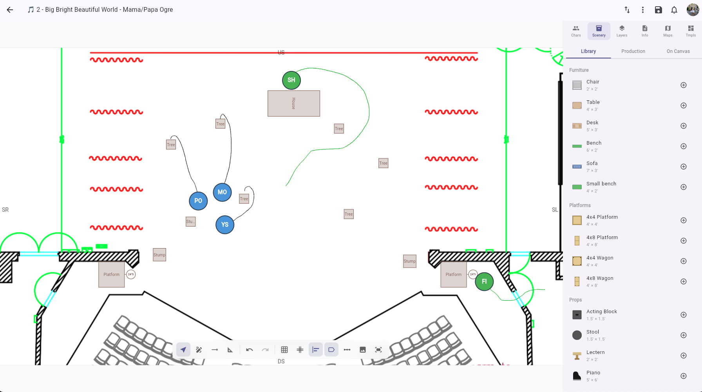
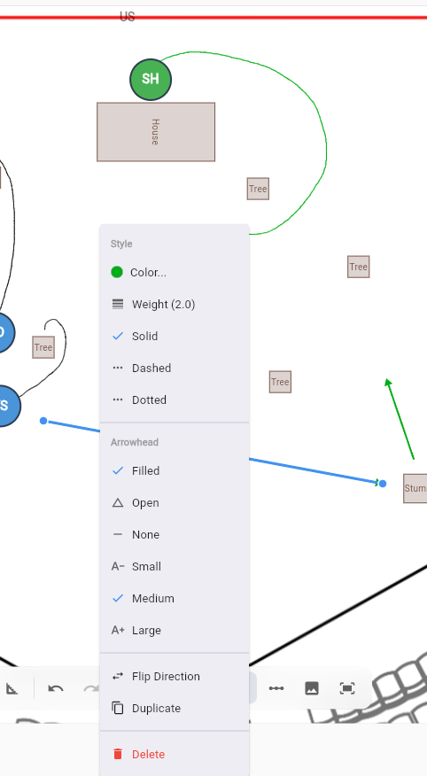
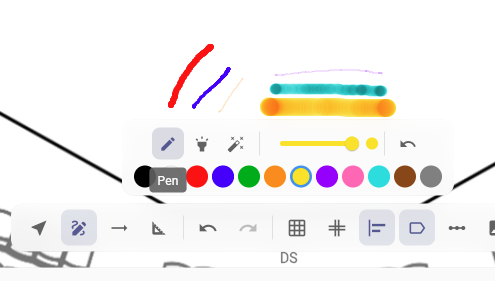
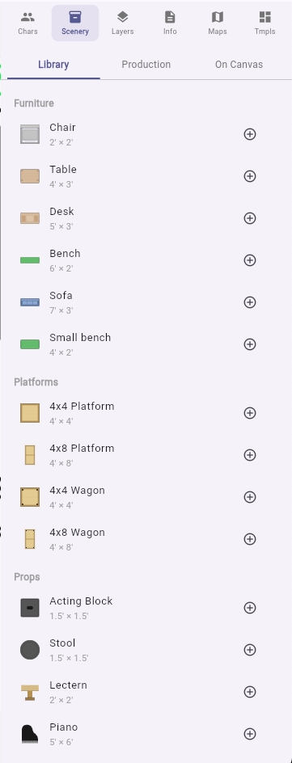

# The Blocking Editor

The blocking editor is a full-screen visual tool for creating stage diagrams that show where characters are positioned during a scene. These diagrams — called blocking maps — can be linked to specific pages, scenes, or songs in your production.

## Opening the editor

From the script view, open the **Blocking panel** and click **New** to create a new blocking map, or click **Open in Editor** on an existing one.

## Editor layout

The blocking editor is divided into three areas:

### Canvas (center)

The main workspace where you place and arrange [character stickers](character-stickers.md), [scenery items](#scenery-items), [text labels](#text-labels), and [freehand drawings](#freehand-drawing). If you've added a background image (like a ground plan or set design), it appears here. You can also enable a [stage grid](#grid-overlay) for precise positioning.

### Info bar (top)

- **Title** — A name for this blocking map (e.g., "Act 1, Scene 2 — Opening positions")
- **Page number** — Links the blocking map to a specific script page
- **Linked structure item** — Connect this blocking to an act, scene, or song from your [production structure](../productions/production-structure.md)
- **Short description** — A one-line summary
- **Detailed notes** — Multi-line notes and instructions

### Sidebar (right)

Six tabs:

- **Characters** — Lists all [characters](../productions/characters.md) in your production. Drag characters from here onto the canvas.
- **Scenery** — Browse the theatrical item library, production-specific assets, and manage scenery on the canvas. See [Scenery items](#scenery-items).
- **Layers** — Manage blocking layers. Each layer can hold its own set of elements, and layers can be shown or hidden independently.
- **Info** — View and edit the blocking map's metadata (title, page, linked structure item, description, notes).
- **Maps** — Browse all blocking maps in the production. Switch between maps, create new ones, or delete existing ones without leaving the editor.
- **Templates** — Save and manage [map templates](#map-templates) that contain stage setups (scenery, background, calibration, grid) without character positions.

## Canvas tools

The floating toolbar at the bottom of the canvas provides tool modes and quick actions:

### Select tool

The default mode. Click elements to select them, drag to move them. Select multiple elements by tapping with shift held. When 2+ characters are selected, a **Group** button appears to create a [character group](#character-groups).

### Draw tool

Freehand drawing directly on the canvas using pen, highlighter, or eraser tools. See [Freehand drawing](#freehand-drawing).

### Arrow tool

Place directional arrows on the canvas to indicate movement paths, sightlines, or crossover patterns. Click once to set the tail (start), then click again to set the head (end).

Double-tap an arrow to open its context menu with options:

- **Dash style** — Solid, dashed, or dotted
- **Arrowhead type** — Filled, open, or none
- **Arrowhead size** — Small, medium, or large
- **Color** — Choose from 12 preset colors
- **Weight** — Adjust stroke width from 0.5 to 8.0
- **Flip direction** — Reverse the arrow
- **Duplicate** — Create a copy offset slightly from the original

Arrows can be dragged by their body to reposition, or by their endpoints to adjust direction.

### Scale calibration tool

Set a real-world scale for your stage by placing two points and entering the distance between them (in feet or meters). This calibration is used by scenery items and the [dance placement ribbon](#dance-placement-ribbon) to display accurate dimensions. Calibrating the scale also auto-resizes library scenery items to their real-world dimensions.

### Quick actions

- **Undo / Redo** — Step backward or forward through your changes
- **Grid toggle** — Show or hide the stage grid overlay
- **Stage labels toggle** — Show or hide stage direction labels (SR, SL, US, DS, etc.)
- **Performer view** — Rotate the canvas 180° so upstage is at the bottom, matching what a performer sees facing the audience

## Freehand drawing

When the **Draw** tool is active, a drawing sub-toolbar appears with:

- **Pen** — Standard freehand drawing with pressure sensitivity (Apple Pencil and other styluses)
- **Highlighter** — Semi-transparent strokes for marking areas
- **Eraser** — Remove individual strokes by touching them
- **Color palette** — Choose from 12 preset colors or pick a custom color
- **Stroke width** — Adjust the line thickness

Drawings are saved as canvas elements and can be placed on specific layers.

## Scenery items

The Scenery panel lets you place set pieces and props on the canvas:

### Library items

A built-in collection of standard theatrical items (platforms, flats, furniture, etc.) with plan-view artwork. Library items have real-world dimensions and scale automatically based on your [scale calibration](#scale-calibration-tool).

### Production assets

Upload show-specific scenery images for your production. These are shared across all blocking maps in the production.

### On Canvas

View and select scenery items that are currently placed on the canvas.

### Spike colors

Each scenery item can have a **spike tape color** — a colored marker showing where the item should be placed on the stage floor. Set the spike color from the [Properties panel](#sidebar-right).

## Character groups

Select 2 or more character stickers and click **Group** to create a character group. Groups render as a dashed rectangle enclosing the member characters with a label (e.g., "Ensemble Left", "Dancers"). Moving the group moves all member characters together. Groups can be ungrouped from the Properties panel.

## Text labels

Add free-form text labels directly on the stage diagram for stage directions, position notes, or any other text. Text labels support custom color and font size.

## Alignment guides

When you drag a scenery item or sticker across the canvas, **alignment guides** appear automatically as magenta lines showing where the element's edges or center line up with other elements. Guides detect alignment on left, center, and right edges horizontally, and top, center, and bottom edges vertically. This makes it easy to line up set pieces precisely without relying on a grid.

## Dance placement ribbon

A horizontal numbered line placed on the canvas for choreography spacing. The ribbon displays numbers counting outward from center (0) in both directions (...3 2 1 0 1 2 3...), with spacing equal to one real-world unit (foot or meter) based on the map's [scale calibration](#scale-calibration-tool).

- **Resize** using the side handles — more numbers appear as the ribbon gets wider
- **Move** by dragging the ribbon body
- **Lock** via double-click context menu to prevent accidental movement
- **Snap** to grid lines and other scenery elements when positioning
- **Performer view** — numbers rotate for readability when the canvas is in performer view

!!! note
    If no scale calibration is set, the ribbon shows a "Set Scale for accurate spacing" overlay. Calibrate your stage first for accurate measurements.

## Grid overlay

Toggle the stage grid from the floating toolbar to display a reference grid over the canvas. The grid can be configured for spacing and snap-to-grid behavior. The grid origin (crosshair) can be dragged to reposition, and locked to prevent accidental movement.

## Background images

You can add a stage layout or set design image as the canvas background:

1. Click the **Pick Background** button in the toolbar
2. Select an image file from your device
3. Use **Edit Background Transform** to adjust the image — move, scale, rotate, or crop it to fit your needs
4. Use **Reset Background Transform** to return to the default position

!!! tip
    If your company has a [venue](#venues) configured, the venue's default background image can be used automatically.

## Venues

Venues represent a physical stage or theater space. They store stage dimensions, a default background image (ground plan), and template scenery elements. When a venue is linked to a blocking map, its stage setup is pre-populated. Venues are managed at the [company level](../account/company-management.md) and can be reused across productions.

## Map templates

A blocking map can be saved as a **template** that contains only the stage setup (scenery, background, calibration, grid) without any character positions. Templates can be used to quickly create new blocking maps with a pre-configured stage layout.

## Draft and published maps

Blocking maps start as **drafts** that are only visible to their creator in the Maps panel. Once saved, they become **published** and are visible to all team members.

## Exporting a blocking map

Individual blocking maps can be exported directly from the editor toolbar's **More** menu:

- **Export as PNG** — saves the canvas as a high-resolution image
- **Export as PDF** — saves the canvas as a PDF page

On web, the file downloads directly. On mobile and desktop apps, it saves to your device storage.

For exporting blocking maps alongside your script, see [Sharing & Exporting](../collaboration/sharing-and-exporting.md).

## Cloning a map

From the **More** menu, choose **Clone** to create a copy of the current blocking map with all elements, background, and settings. The clone gets a "(Copy)" suffix in its title.

## Auto-save

Changes are automatically saved shortly after you stop making edits. A "Saving..." indicator appears in the toolbar while a save is in progress. Each save also generates a [thumbnail](blocking-thumbnails.md) for the blocking map — one for the director view and one for the performer view.

## Related

- [Character Stickers](character-stickers.md) — How to place, move, and customize stickers
- [Blocking Thumbnails](blocking-thumbnails.md) — Preview images for your blocking maps
- [Tags](../annotations/tags.md#blocking-tags) — Placing blocking maps on script pages
