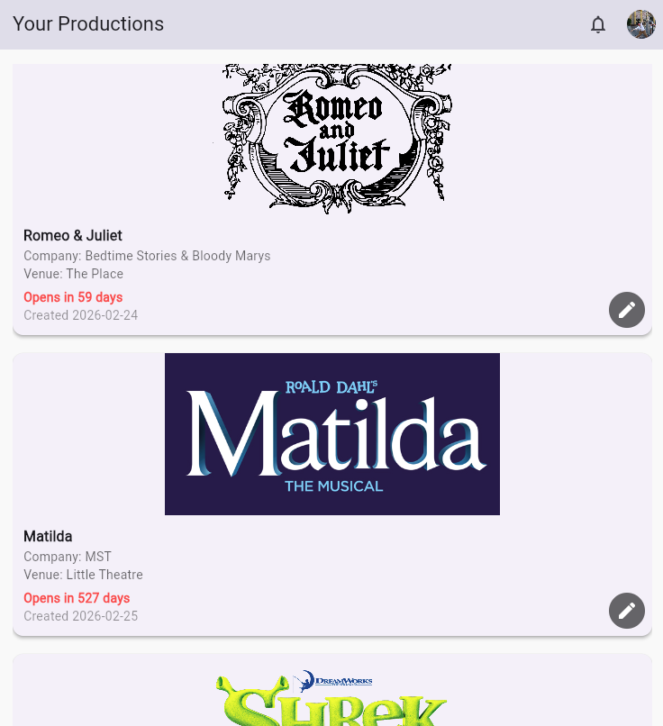
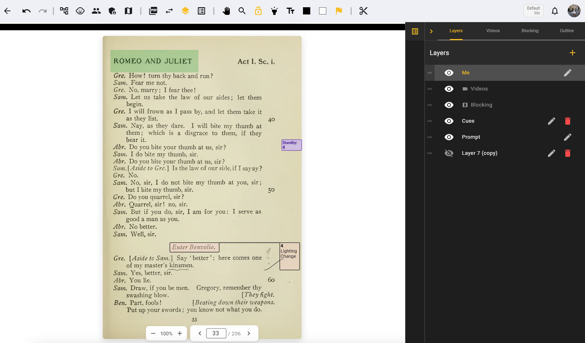
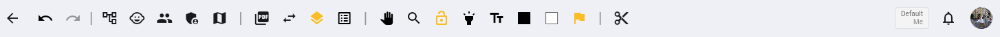
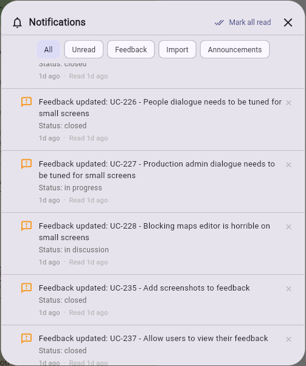
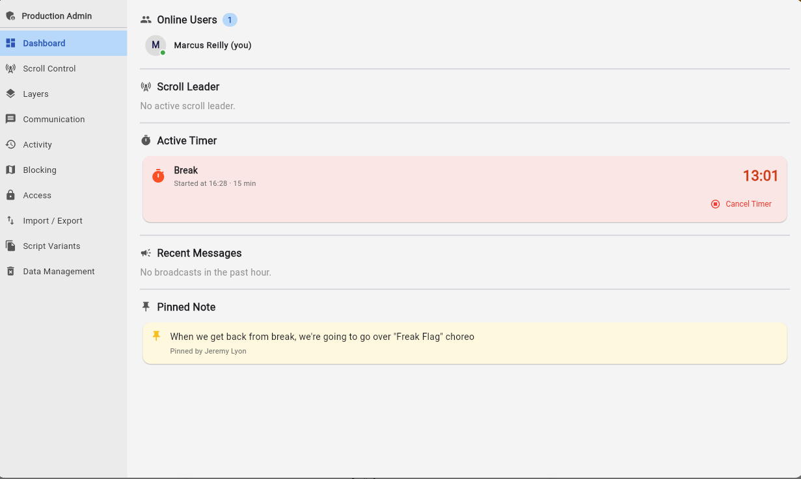
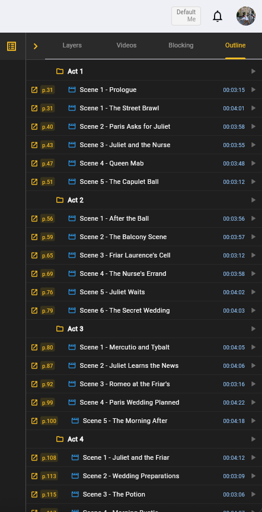

# Navigating the App

ScriptMagic is organized around two main screens: the **productions dashboard** and the **script view**. Here's how to find your way around.

## Productions dashboard

This is your home screen after signing in. It lists all the productions you have access to.

Each production is shown as a card with:

- Cover image (or a placeholder)
- Production name
- Company name
- Venue
- Opening date with a countdown (e.g., "Opens in 5 days")
- An **Edit** button if you have permission to manage the production
- **Download for offline** buttons (see [Offline mode](#offline-mode))

Click any production card to open it in the script view.

!!! tip
    Productions are sorted by opening date, with upcoming shows listed first. Once a show has opened, a celebration banner appears on its card.

## Script view

The script view is where you'll spend most of your time. This is the main workspace for reading, annotating, and collaborating on a script.

### Script area

- **Script pages** — The central area displays your script pages. Scroll vertically to move through the page content, and use navigation controls to move between pages.
- **Navigation and zoom bar** — A combined control bar at the bottom with zoom controls on the left (−/+, percentage display, tap to reset) and page navigation on the right (previous/next arrows, page number input, page counter). Supports Roman numerals for front matter (i, ii, iii). Zoom range: 50% to 300% in 25% steps. See [Viewing & Navigating Pages](../scripts/viewing-and-navigating-pages.md).
- **Pinch-to-zoom** — On mobile and tablet, pinch to zoom in and out on the script page. Pan by dragging when zoomed in.
- **Script variant selector** — If your production has multiple [script variants](../scripts/script-variants.md), switch between them from the toolbar.

### Toolbar

The toolbar at the top of the script view includes:

- **Undo / Redo** — Step backward or forward through annotation changes
- **Production Structure** — Open the production structure management dialog
- **Characters** — Open the character management dialog
- **People** — Manage production members (Production Team and Admin only)
- **Blocking Editor** — Open the [blocking editor](../blocking/the-blocking-editor.md) (Production Team and Admin only)
- **Production Admin** — Open the [production admin dashboard](#production-admin-dashboard) (Production Admin only)
- **Reports** — Open the [breakdown reports](../annotations/cues.md#reports) dialog
- **Export Script** — Export the annotated script as a PDF. See [Sharing & Exporting](../collaboration/sharing-and-exporting.md).
- **Inspect Highlights** — Toggle inspection mode to view highlight details on tap
- **Cut Cues** — Toggle visibility of [cut cues](../annotations/cues.md#cut-cues) on the script
- **Move / Pan** — Toggle click-drag panning on web (on mobile, pan is automatic when zoomed in)
- **Active layer badge** — Shows the name of your currently active layer in the toolbar
- **Notification bell** — Shows unread notification count. See [Notifications](#notifications).

### Side panels

- **Layers panel** — Manage your annotation [layers](../annotations/understanding-layers.md). Toggle visibility, create new layers, and switch your active editing layer.
- **Outline panel** — Browse your [production structure](../productions/production-structure.md) hierarchy (acts, scenes, songs) with page links and built-in duration timers. See [Outline panel](#outline-panel).
- **Cue list panel** — View all [cues](../annotations/cues.md) across your cue layers in a sortable, filterable list with inline editing.
- **Blocking panel** — Access [blocking maps](../blocking/the-blocking-editor.md) and open the blocking editor.
- **Music panel** — Manage [music tags](../annotations/tags.md#music-tags) and audio files.
- **Video panel** — Manage [video tags](../annotations/tags.md#video-tags) and video links. Drag video tags onto script pages.
- **Music, video, and blocking tags** — [Media tags](../annotations/tags.md) appear on script pages where they've been placed.
- **History panel** — View and create [snapshots](../productions/snapshots.md) of your production's cues and highlights. Compare snapshots against the current state and restore individual items or entire layers.
- **Help search** — Search the help documentation from within the app for quick answers.

On mobile and tablet devices, side panels slide in from the right as overlays rather than displaying side-by-side.

### DCA toolbar

When a [Sound DCA layer](../annotations/understanding-layers.md#sound-dca-layers) is active, a DCA toolbar appears above the script showing 16 numbered circles and a Mic Cue marker. Drag these onto the script page to place sound channel assignments. See [Sound DCA Layers](../annotations/understanding-layers.md#sound-dca-layers) for details.

### Page movement leader and follow

ScriptMagic supports synchronized page navigation for rehearsals:

- **Page Movement Leader** — Click the leader toggle in the toolbar to broadcast your page position to everyone in the production. A red indicator shows when you're the active leader.
- **Follow** — Click the follow toggle to sync your view with the leader's page navigation. The leader's name is displayed while following.

## Notifications

The notification bell in the toolbar shows your unread notification count. Tap the bell to open the notification panel. Notifications include:

- **Script imported** — when a script import completes on the server
- **Feedback updated** — when your submitted feedback receives a status change
- **Site announcements** — system-wide messages from ScriptMagic

From the notification panel you can filter by type (all, unread, feedback, imports, announcements), mark all as read, or swipe to delete individual notifications.

## Production admin dashboard

The production admin dashboard (available to Production Admin roles) provides centralized controls for managing a live production. It uses a sidebar navigation with the following sections:

- **Dashboard** — Overview showing online users, the current scroll leader, any active timer (e.g., break countdown), recent broadcast messages, and the pinned note
- **Scroll Control** — Take or assign page movement leader status, or clear the leader
- **Layers** — View all production layers, change layer visibility, and copy layers as personal copies
- **Communication** — Broadcast messages to all connected users, start countdown timers (for breaks, places calls, etc.), and pin persistent notes visible to the whole team
- **Activity** — View a real-time audit log of recent edits, broadcasts, and actions with filtering by user, layer, and activity type
- **Blocking** — Manage blocking maps for the production
- **Access** — Control production access and permissions
- **Import / Export** — Import and export production data
- **Script Variants** — Manage [script variants](../scripts/script-variants.md) for the production
- **Data Management** — Manage production data and storage
- **Snapshots** — Configure which layers are included in [manual and automatic snapshots](../productions/snapshots.md#snapshot-layer-configuration). Toggle individual layers or use Include All / Exclude All.
- **Analytics** — View production statistics (pages, layers, people, highlights, cues, snapshots), cumulative activity metrics (sessions, highlights created, cues created, pages viewed, emails sent, OCR extractions, broadcasts), and a recent audit log of admin actions

## Outline panel

The outline panel displays your production's structure as a navigable tree — acts, scenes, songs, intermissions, and transitions. From here you can:

- **Jump to a page** — Click any structure item's page number to navigate directly to that point in the script
- **View vocal score pages** — Songs show their vocal score page number (e.g., "VS p.12") when set
- **Start a timer** — Click the stopwatch icon on any structure item to start a duration timer. Multiple timers can run simultaneously, useful for timing scenes or transitions during rehearsals. Elapsed time is displayed in red while running.
- **View hierarchy** — See the full structure of your show at a glance, with scenes nested inside acts and songs nested inside scenes

### Run time calculator

At the bottom of the outline panel, a collapsible run time calculator lets you:

- Check or uncheck individual structure items to include them in the total
- Use **Select All / Deselect All** for quick toggling
- View the total runtime of selected items

!!! tip
    The outline panel is especially useful during rehearsals for quickly navigating to specific scenes and timing them in real time.

## Offline mode

ScriptMagic supports downloading productions for offline use on iOS, Android, macOS, Windows, and Linux (not available on web). From the productions dashboard:

1. Click the download button on a production card
2. Choose which components to download:
    - **Script pages** — the page images for viewing offline
    - **Annotations** — your highlights, notes, and cues
    - **Music** — audio files linked to your production
    - **Blocking maps** — your blocking diagrams and thumbnails
3. The download progress is shown in real time with size estimates for each component
4. Once downloaded, the production is available without an internet connection

Changes made offline are queued and synced automatically when you reconnect.

## Account menu

The account menu is available in the top-right corner of most screens. From here you can:

- **Edit Profile** — Update your name, phone, pronouns, address, emergency contact, and profile photo. See [Profile Settings](../account/profile-settings.md).
- **Help** — Search the help documentation for answers to your questions
- **Submit Feedback** — Report bugs or request features
- **My Feedback** — View your submitted feedback history and track status updates
- **About ScriptMagic** — View app version and information
- **Legal** — View terms, privacy policy, and legal information
- **Admin Dashboard** — Access administrative tools (visible to admins only)
- **Log Out** — Sign out of your account
