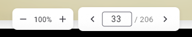

# Viewing & Navigating Pages

The script view displays your script one page at a time, with tools for navigation and zoom. This is the main workspace where you'll read, annotate, and collaborate on your script.

## Page navigation

- **Previous / Next buttons** — step through pages one at a time using the arrow buttons
- **Page number input** — type a page number and press Enter to jump directly to that page
- **Roman numerals** — for front matter pages before "Page 1" (set via the [page offset](uploading-a-script.md#page-offset)), you can enter Roman numerals (i, ii, iii, etc.)
- **Page counter** — shows your current position (e.g., "5 / 120")

!!! tip
    The next few pages are preloaded in the background so navigation feels smooth, even on slower connections.

## Zooming

A compact zoom control toolbar is displayed at the bottom of the script view:

- **Zoom out button** — decrease zoom by 25% per click (minimum 50%)
- **Zoom percentage display** — shows the current zoom level. Click to reset to 100%.
- **Zoom in button** — increase zoom by 25% per click (maximum 300%)

### Pinch-to-zoom

On iOS and Android, pinch-to-zoom is supported directly on the script page. When zoomed in past 100%, you can pan by dragging to view different parts of the page.

### Move / Pan mode

On web and desktop, use the **Move / Pan** toggle in the toolbar to enable click-drag panning. This is useful when zoomed in to navigate around the page without accidentally creating annotations.

## Scrolling

Pages are displayed vertically. Scroll down to move through the page content. To advance to the next page, use the navigation buttons or enter a page number.

## Related

- [Uploading a Script](uploading-a-script.md) — How to upload and replace script PDFs
- [Script Variants](script-variants.md) — Create alternative page orderings
- [Highlights](../annotations/highlights.md) — Mark up your script pages with colored overlays
- [Cues](../annotations/cues.md) — Place cue markers on script pages
